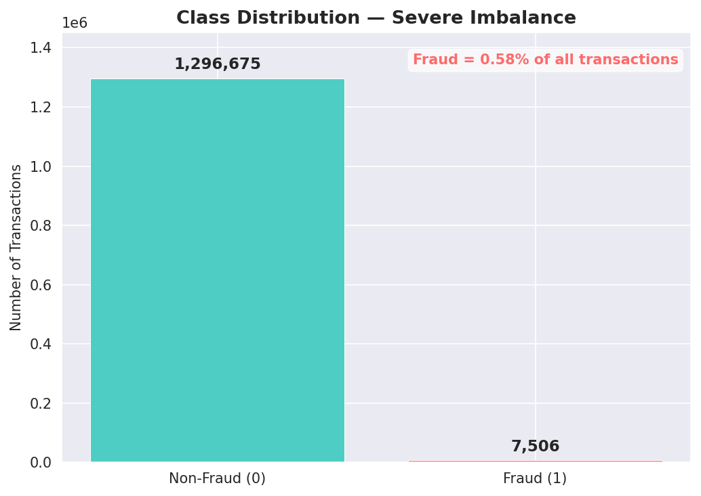
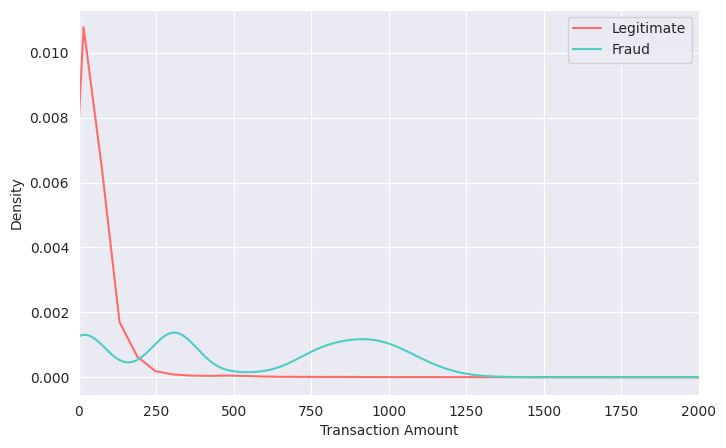
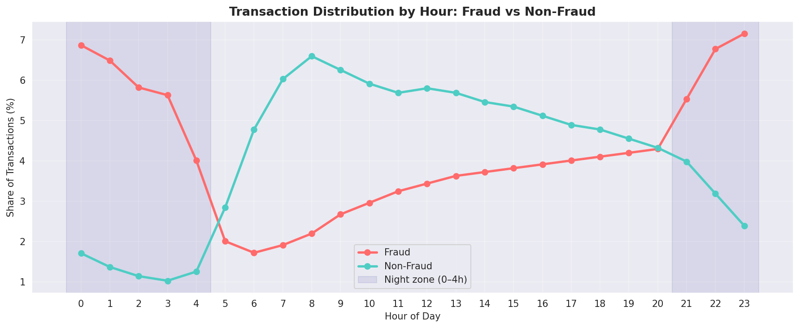

# 💳 Credit Card Fraud Detection

Binary classification model to detect fraudulent credit card transactions using behavioral and temporal features, evaluated on PR-AUC to handle severe class imbalance.

---

## 📌 Problem Statement

Credit card fraud datasets are highly imbalanced — fraudulent transactions represent a tiny fraction of all activity. Standard accuracy metrics fail in this setting. This project builds a detection pipeline that prioritizes catching fraud (high Recall) while minimizing false alerts (high Precision), using **PR-AUC** as the primary evaluation metric.



---

## 📂 Dataset

**Source:** [Fraud Detection Dataset — Kaggle (kartik2112)](https://www.kaggle.com/datasets/kartik2112/fraud-detection)

| Split | Rows | Period |
|---|---|---|
| Train | fraudTrain.csv | Jan 2019 – Jun 2020 |
| Test | fraudTest.csv | Jul 2020 – Dec 2020 |

---

## 🔧 Feature Engineering

### Velocity Features *(most impactful)*
Aggregated per credit card number over rolling time windows:

| Feature | Description |
|---|---|
| `time_since_last` | Seconds since the card's last transaction |
| `txn_count_1h` | Number of transactions in the past 1 hour |
| `amt_sum_1h` | Total amount spent in the past 1 hour |
| `amt_mean_24h` | Rolling 24-hour average amount |
| `amt_vs_mean_24h` | Ratio of current amount vs 24h average |

> **Why velocity?** Raw amount tells you "this transaction is large." Velocity tells you "this transaction is large *relative to this card's normal behavior*" — a far stronger fraud signal.



### Temporal Features



- Extracted `Day`, `Month`, `Hour` from transaction datetime
- Created `is_night` binary flag (hours 0–4 and 21–23) based on observed fraud concentration

### Age Features
- Computed customer age using 2021 as reference year (dataset spans 2019–2020)
- Binned into meaningful groups: `Student / Young Adult / Adult / Middle Age / Senior / Elderly`

### Amount Features
- Binned `amt` into 3 groups (`Low` / `Mid` / `High`) to capture the bimodal fraud distribution (~$100 and ~$500 peaks)

---

## ⚖️ Handling Class Imbalance

Three strategies were trained and compared on the (never-resampled) test set:

| Strategy | Approach |
|---|---|
| Original | Use `scale_pos_weight` in LightGBM to upweight fraud class |
| Undersampling | `RandomUnderSampler` to balance classes |
| Oversampling | `SMOTE` with k=5 neighbors to synthesize fraud samples |

**Winner: Original + `scale_pos_weight`** — highest PR-AUC on the real-world imbalanced test set.

---

## 🤖 Model

**LightGBM** with the following configuration:
- `n_estimators=500`, `learning_rate=0.05`, `num_leaves=63`
- `subsample=0.8`, `colsample_bytree=0.8`
- Evaluated at `threshold=0.5` (tunable for production use)

Other models tested (commented out in notebook): Logistic Regression, Decision Tree, Random Forest, XGBoost.

---

## 📊 Evaluation

Primary metric: **PR-AUC** (Area Under the Precision-Recall Curve)

PR-AUC is preferred over ROC-AUC for imbalanced datasets because it directly measures performance on the minority (fraud) class, without being inflated by the large number of true negatives.

---

## 🚀 How to Run

1. Download the dataset from Kaggle and place CSVs in the input path
2. Open the notebook in Kaggle or Jupyter
3. Run all cells in order — feature engineering → resampling → training → evaluation

```python
# Key dependency
pip install -r requirements.txt
```

---

## 🔮 Future Improvements

- **Geo-velocity features** — flag physically impossible transactions (e.g. two transactions in different countries within minutes)
- **Threshold optimization** — tune decision threshold using a business cost matrix (cost of FP vs FN) instead of default 0.5
- **Hyperparameter Tuning** — current LightGBM uses near-default parameters; tuning `num_leaves`, `max_depth`, and `learning_rate` via GridSearch or Optuna could improve PR-AUC further
- **Feature Importance Analysis** — evaluate how velocity features rank against other features to validate the engineering effort and identify candidates for removal